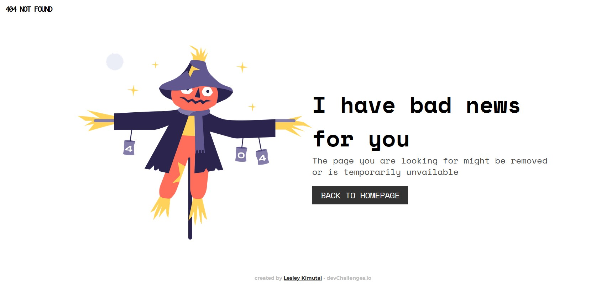
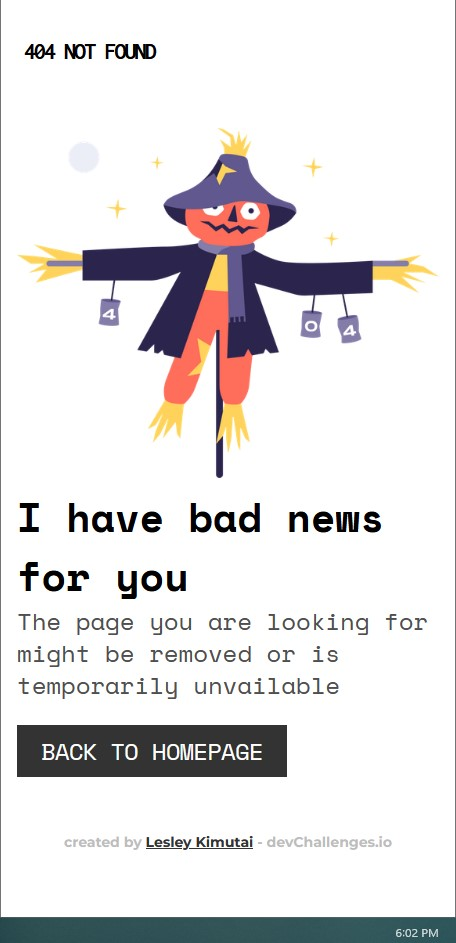

<!-- Please update value in the {}  -->

<h1 align="center">404 Not Found</h1>

   Solution for a challenge from  <a href="http://devchallenges.io" target="_blank">Devchallenges.io</a>.

  <h3>
    <a href="https://issagoodlifeinc.github.io/404-Not-Found/">
      Demo
    </a>
     | 
    <a href="https://github.com/issagoodlifeInc/404-Not-Found.git">
      Solution
    </a>
     | 
    <a href="https://devchallenges.io/challenges/wBunSb7FPrIepJZAg0sY">
      Challenge
    </a>
  </h3>

<!-- TABLE OF CONTENTS -->

## Table of Contents

- [Table of Contents](#table-of-contents)
- [Overview](#overview)
  - [Built With](#built-with)
- [Features](#features)
- [Acknowledgements](#acknowledgements)
- [Contact](#contact)

<!-- OVERVIEW -->

## Overview

- The larger screen view of the mockup

- The mobile screen view of the challenge

- It wasn't that hard to recreate the mockup but my tunaround time could have been better
- Also my css could have been minimal 

- Glad to practice on my flexbox

### Built With

- Semantic HTML
- CSS
- Mobile first workflow

## Features

<!-- List the features of your application or follow the template. Don't share the figma file here :) -->

This application/site was created as a submission to a [DevChallenges](https://devchallenges.io/challenges) challenge. The [challenge](https://devchallenges.io/challenges/wBunSb7FPrIepJZAg0sY) was to build an application to complete the given user stories.

## Acknowledgements

- [Mordern CSS](https://moderncss.dev/practical-uses-of-css-math-functions-calc-clamp-min-max/)
- Using min()  and clamp()

## Contact

- Website [Lesley Kimutai](https://leskimfamily.herokuapp.com/))
- GitHub [@Leskim](https://Leskim)
- Twitter [@LesleyKimutai](https://LesleyKimutai)
